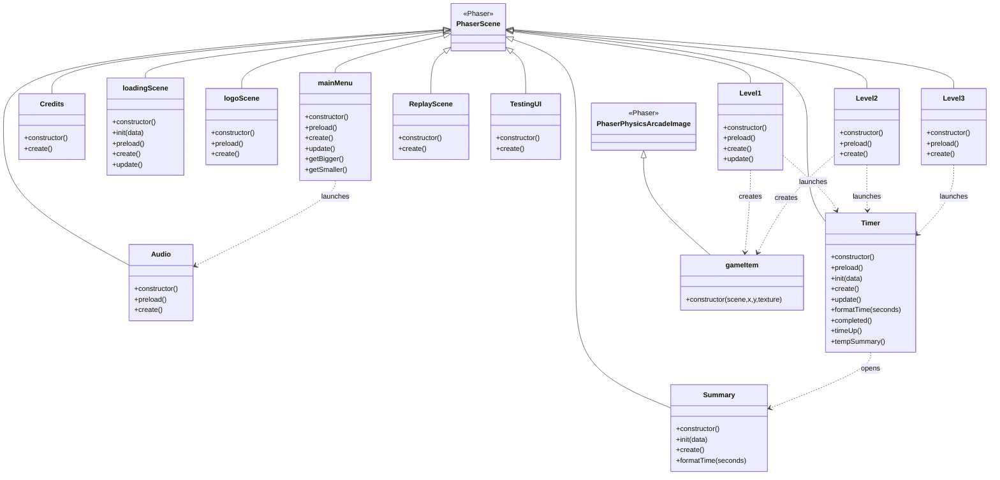

# Class Diagram

## Notes

Methods inherited from Phaser and overridden by the project include:

* `preload()`
* `init()`
* `create()`
* `update()`

Custom methods authored by the team include:

* `getBigger()`
* `getSmaller()`
* `formatTime()`
* `completed()`
* `timeUp()`
* `tempSummary()`

The architecture follows a scene-based design in which most gameplay systems are implemented as subclasses of `Phaser.Scene`, while reusable ingredient objects are implemented through the `gameItem` prefab class, which extends `Phaser.Physics.Arcade.Image`.
